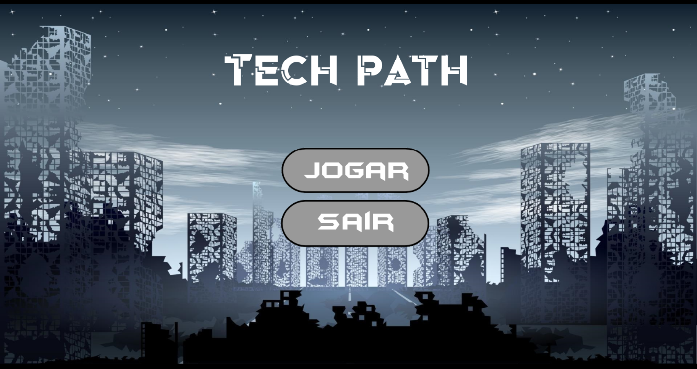

# Inteli - Instituto de Tecnologia e Liderança 

<p align="center">
<a href= "https://www.inteli.edu.br/"></a>
</p>

# Tech Path - by Eligius
## Integrantes: [Felipe Silberberg](https://www.linkedin.com/in/felipe-silberberg-111998230/ "Felipe Silberberg"), [Jordan Andrade](https://github.com/jordan-acs "Jordan Andrade"), [Uelinton Rocha](https://www.linkedin.com/in/uelitonrocha/ "Uelinton Rocha"), [Vitor Augusto](https://github.com/dtonavitor "Vitor Augusto"), [Wagner](https://github.com/WagnerBarcelos "Wagner").

## Descrição
💡 Este jogo busca aprimorar o 'approach' do Inteli para estudantes de ensino médio que pensam, ou nunca pensaram, em estudar alguma das áreas da computação, além de captar outros estudantes que não buscavam o Inteli.

<p align="center">

</p>

## 🛠 Para Executar

**Android:**

Faça o Download do JOGO.apk no seu celular.
Execute o APK e siga as instruções de seu telefone.

```sh
Coloque código do prompt de comnando se for necessário
```

**Windows:**
É necessário ter o aplicativo do Godot instalado. Você pode encontrar o Godot [aqui](https://godotengine.org/)
Encontre "Tech Path.exe" [aqui](./executáveis/Windows)

**HTML:**
Clique no arquivo "index.html", que está [aqui](./executáveis/HTML), e abra-o como uma página WEB (através de algum navegador).

## 📈 Exemplo de uso

Alguns exemplos interessantes e úteis sobre como seu projeto pode ser utilizado.

Adicione blocos de códigos e, se necessário, screenshots.

## 💻 Configuração para Desenvolvimento

Descreva como instalar todas as dependências para desenvolvimento e como rodar um test-suite automatizado de algum tipo.

## 🗃 Histórico de lançamentos

A cada atualização os detalhes devem ser lançados aqui.

* 0.2.2 - 13/04/2022
    * Versão final do jogo
    * Minigames de Ciência da Computação e Engenharia de Software não podem ser jogados novamente após acerto
    * MUDANÇA: Minigame de Engenharia da COmputação com dicas para trazer sentido para o jogador
    * MUDANÇA: Atualização de comentários dos códigos
* 0.2.1 - 01/04/2022
    * MUDANÇA: Atualização do minigame de Engenharia da Computação (Mudança de funcionamento)
    * MUDANÇA: Atualização de comentários dos códigos
    * MUDANÇA: Atualização do cenário para facilitar a orientação do jogador
    * ADD: Adiciona minigame de Engenharia de Software
    * ADD: Cutscene do jogo
    * ADD: Adiciona gráfico no final do jogo com pontuação
    * REMOVE: Remove cena inicial com o personagem apenas andando
* 0.2.0 - 18/03/2022
    * MUDANÇA: Atualização de comentários dos códigos
    * ADD: Adiciona minigames de Sistema de Informação, Ciência da Computação e Engenharia da Computação
* 0.1.1 - 04/03/2022
    * MUDANÇA: Adição de comentários nos códigos
    * ADD: Adiciona 'button.gd' e 'button.tscn'
    * ADD: Adiciona 'get_tree().quit()'
    * ADD: Adiciona 'get_tree().change_scene("res://scenes/menu.tscn")'
* 0.1.0 - 18/02/2022
    * O primeiro lançamento adequado
    * Apenas uma cena com o personagem se movimentando
* 0.0.1 - 01/02/2022
    * Trabalho em andamento

## 📋 Licença/License

<p xmlns:cc="http://creativecommons.org/ns#" xmlns:dct="http://purl.org/dc/terms/"><a property="dct:title" rel="cc:attributionURL" href="https://github.com/Spidus/Teste_Final_1">MODELO GIT INTELI</a> by <a rel="cc:attributionURL dct:creator" property="cc:attributionName" href="https://www.yggbrasil.com.br/vr">INTELI, VICTOR BRUNO ALEXANDER ROSETTI DE QUIROZ</a> is licensed under <a href="http://creativecommons.org/licenses/by/4.0/?ref=chooser-v1" target="_blank" rel="license noopener noreferrer" style="display:inline-block;">Attribution 4.0 International</a></p>

## 🎓 Referências

Este Readme foi baseado no template do Prof. Victor Bruno Alexander Rosetti de Quiroz do Instituto de Tecnologia e Liderança - Inteli.

Imagens, música e arte utilizadas no jogo que não foram desenvolvidas pelo grupo:

<href="https://pixabay.com/music/ambient-caves-of-dawn-10376/"> - Música Caves of Down
<href="https://f0x0ne.itch.io/2d-sci-fi-platform-builder"> - 2D Sci-Fi Platform Builder
<href="https://trevor-pupkin.itch.io/tech-dungeon-roguelite"> - Tech Dungeon 
<href="http://pixelartmaker.com/art/3762b5722d32af4"> - Character Sheet
<href="https://www.gratispng.com/png-srwy50/"> - Robô NPC
<href="https://wifflegif.com/gifs/706478-pixel-art-nutella-gif"> - Nutella
<href="https://www.pinterest.es/pin/48835977179360104/"> - Lata de tomate
<href="https://www.dreamstime.com/crowd-people-wearing-masks-quarantine-virus-threat-pixel-art-illustration-concept-image175925617">  - Multidão de pessoas
<href="https://www.google.com/imgres?imgurl=https%3A%2F%2Fi.redd.it%2Fovytvmxi2hh41.png&imgrefurl=https%3A%2F%2Fwww.mybooksolutions.com%2Frobot-pixel-art&tbnid=77UNhwIQ0dww_M&vet=12ahUKEwiAxf2AlI_3AhU2N7kGHaLZDzkQMyhhegUIARCxAQ..i&docid=NGbiClPVZbThDM&w=1280&h=2048&q=robot%20pixel%20art&ved=2ahUKEwiAxf2AlI_3AhU2N7kGHaLZDzkQMyhhegUIARCxAQ"> - Robô Cutscene
<href="https://www.shutterstock.com/pt/image-vector/vector-pixel-art-missile-isolated-721755184"> - Mísseis
<href="https://www.artstation.com/artwork/NWR8N"> - Laboratório
<href="https://br.pinterest.com/pin/416020084329209132/"> - cenário cutscene
